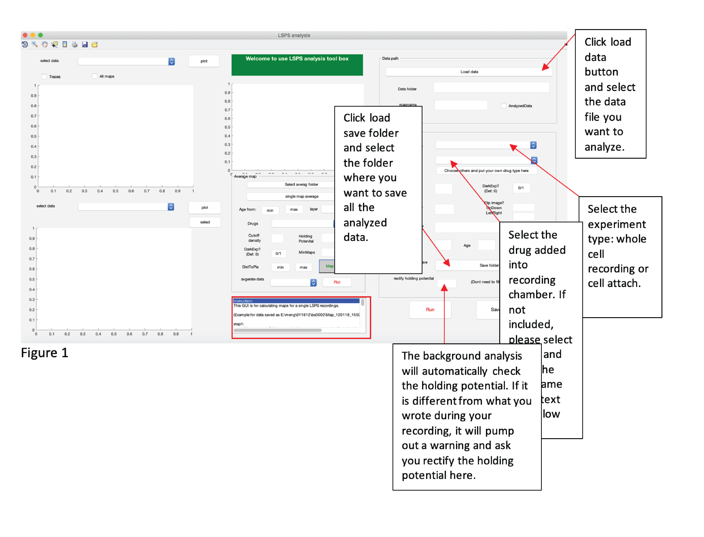

# LSPSTOOLBOX
LSPS analysis toolbox is a MATLAB based graphical user interface that allows users to systematic analyze the connection pattern of specific neurons in certain cortical location through whole cell (or cell attach) experiment combined with Laser Scanning Photo Stimulation (LSPS) in a semi-unsupervised manner. The recorded synaptic events triggered by laser uncaging will be first denoised and captured through different filters.  The technique we used (such as linear regression and exponential fittings) for event detection could capture 99% of the synaptic events including the weak ones. The connection patterns (connection strength (charge or peak), connection location (with single traces imbedded)) to a single cell could be visualized (left side of the GUI).  Population analysis and statistic comparison are also provided (middle column, GUI). All the generated figures are automatically saved into  *.fig and *.eps versons in the same folder where the raw data is selected. This GUI is user friendly and editable. It could generate ready-to-published figures. This GUI is widely used in our lab and helped published more than 20 papers in high impact journals. 

Instructions:

Step 1: Run test.m and fill in all the information on the righthand side and click run. The details are shown in the Fig.1. We also gave an example in the Instruction box (highlighted)

 
Figure 1

Try this markdown:

Step 2. Click run. The run button will change to calculating.... 
 
Figure 2

A slice window (Fig. 3) will pump out and ask you click the layer boundaries. The number of boundaries you lick depends on what the purpose of your experiments. The default number is 5 which means you need to click 5 boundaries. You can change the number of boundaries by inputting the number in the text box on the right side of BD# (highlighted). As far as the analysis finishes, the run button return to “run” . You could save all the input information for this data by click save button. A screenshot with all the input information will be saved 
 
Figure 3

Data visualization (the left column of the GUI)
Click the popup menu and select the figure you want to plot. If the data you selected is from whole cell recording, you could select either peak, charge, latency in the upper panel. To visualize where the input is from relative to the recorded cell, select the figure type in the popup mean in the bottom panel (Fig. 5). 
 
Figure 4
 
Figure 5

We could also look at the raw data by select traces+DIC image （Fig. 6）. The red colored traces are the ones presenting events. Since the traces are quite small, you could plot the ones interesting to you separately by click “select button”. You could click the specific spots that you are interested. It will automatically select the spots that are close to the clicked locations and also have shown events and automatically plot the events of those spots in a separate window. If none of the spots close to the click location has shown events, it will return the traces of the closest one.  

 
Fig.6

